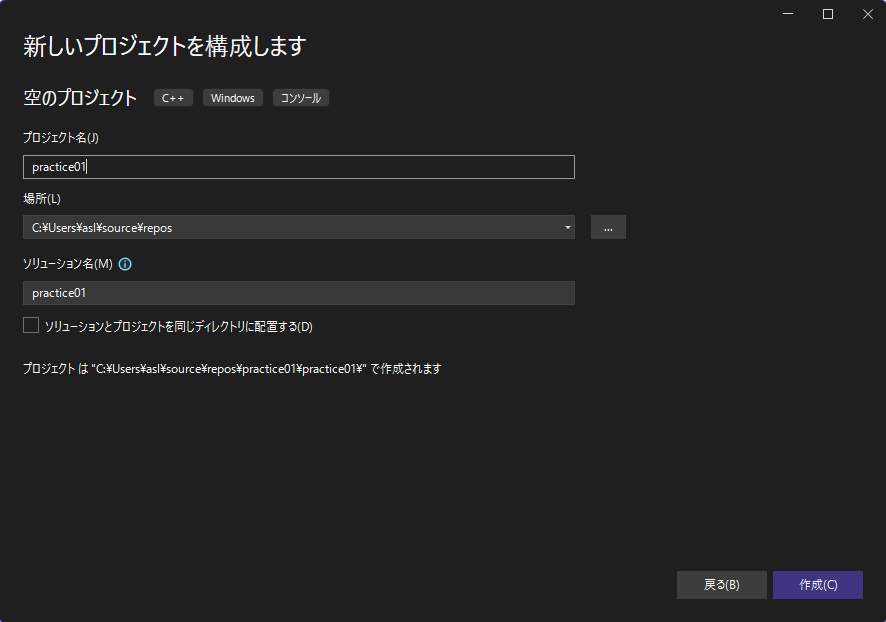
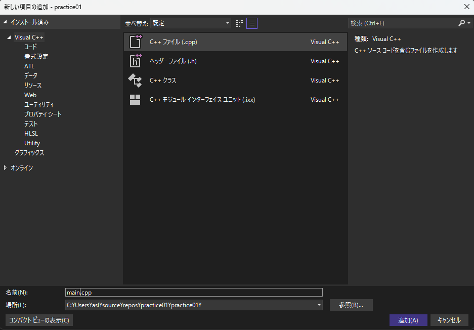
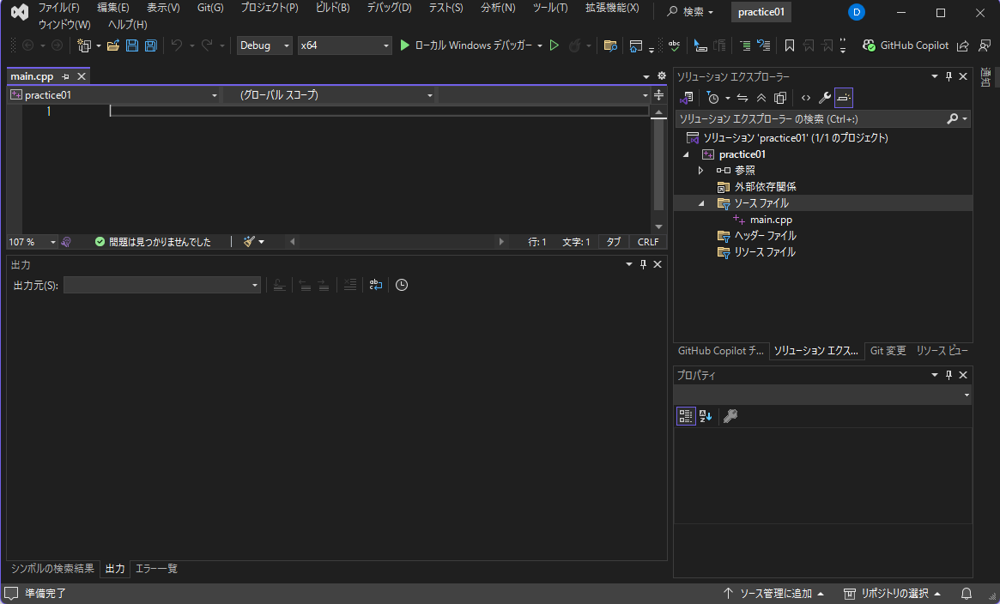
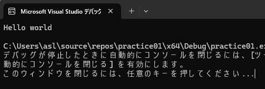
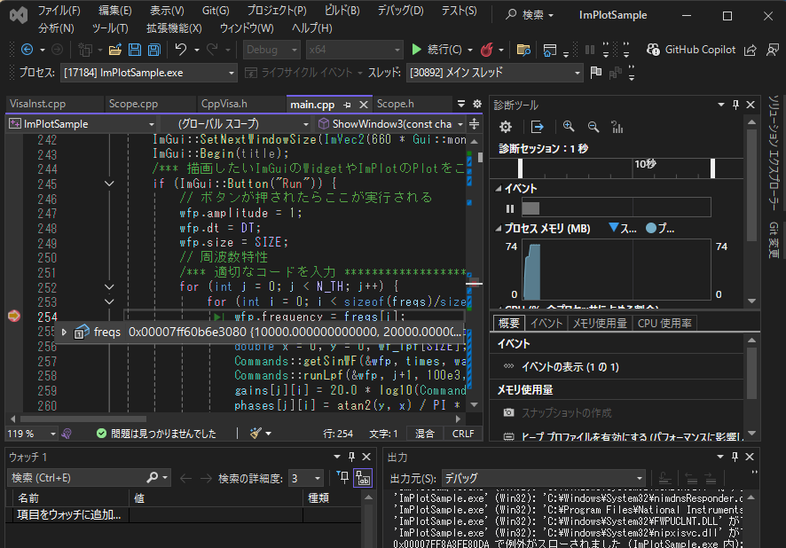

# Visual Studioの使い方

この資料では、Visual Studioを使ってC言語の基本的なプログラムを作成・実行する方法を学びます。

- **注意1: 一つのプロジェクトの中にmain関数は一つである必要があります。つまり、新しいプログラムを作成する際は、新たにプロジェクトを作成してください。**
- **注意2: Visual Studioではデフォルトではscanfが使えません。`scanf_s`を使うか、プログラムの最初の行に`#define _CRT_SECURE_NO_WARNINGS`を挿入してください。**
---

## 始め方

1. Visual Studio 起動する
    1. スタートメニューから「Visual Studio」を選択
    1. 起動画面が表示される
    1. 画面右下の「新しいプロジェクトの作成」をクリック
    

1. 新しいプロジェクトを作成する
    1. 「新しいプロジェクトの作成」画面で「空のプロジェクト」を選択。

    - 補足: 今回は基本を学ぶため、余計な設定がない「空のプロジェクト」を選びます。

1. プロジェクト名と保存場所を設定する
    1. プロジェクト名を入力（例:`practice01`）
    1. 保存場所を指定(Zドライブを推奨)
    1. ウィンドウ右下にある「作成」ボタンをクリック
    
    - 補足: どこに保存してもプログラム開発はできますが、学校で各個人に割り当てられているネットワークドライブ(Z:\)を保存場所に選択すると、どの席のPCにログインしても同じようにそのファイルにアクセスできます。

1. ソースファイルを追加する
    1. 「ソリューションエクスプローラー」の「ソースファイル」を右クリックして現れるショートカットメニューの「追加」→「新しい項目」をクリック
      
    1. 「C++ファイル(.cpp)」を選択し、「名前」を`main.cpp`として、右下の「追加」ボタンをクリック
      
    1. 「ソリューションエクスプローラー」に`main.cpp`が追加される
      
    - 補足: 「ソリューション」は複数のプロジェクトをまとめる箱のようなもの、「プロジェクト」は一つのプログラムに必要な複数のファイルをまとめたものです。この文書の例では一つのソリューションの中には一つのプロジェクトしか入っていません。
    - 補足: 拡張子`.cpp`はC++言語のプログラムであることを表します。C言語の拡張子は`.c`です。C++はCのスーパーセットなので、Ｃのプログラムを正しく実行できます。C++特有の機能を利用したライブラリ(例えばDear ImGUIなど)を使用するためには拡張子を`.cpp`にする必要があります。

1. コードを書く
    1. `main.cpp`に以下のコードを記入
    ```cpp
    #include <stdio.h>
    int main() {
        printf("Hello world\n");
        return 0;
    }
    ```

1. ビルドと実行
    1. メニューの「デバッグ」→「デバッグの開始」または「F5」。緑色の再生マークのアイコン「▶ローカル Windows デバッガー」をクリック、でも可。
      
    1. コンソール画面(黒いウィンドウ)がポップアップし「Hello world」と表示される
      
    - 補足: 「ビルド」はプログラムをPCがわかる形（実行ファイル）に変換する作業のことを言います。
    - 補足: プログラムが終了している場合(今回の場合だと`Hello world`が表示されたら)、Enterキーを押すと閉じることができます。

---

## Visual Studioを終了してから再度開発を始める場合

- ソリューションファイル(`*.sln`、例:`practice01.sln`)をダブルクリック
   

---

## エラーが出た場合

- Visual Studioではデフォルトではscanfが使えません。`scanf_s`を使うか、プログラムの最初の行に`#define _CRT_SECURE_NO_WARNINGS`を挿入してください。
- 赤い文字の内容を確認し、スペルミス(例えば、正`printf`、誤`print`とか)や記号の抜け(例えば`;`)がないか見直しましょう。
- カッコ(`{}`、`()`または`[]`)の対応関係は合っていますか？インデント(左側の空白、段落、字下げのこと)とカッコの位置を合わせると、間違えにくくなります。

### 💻 初学者がつまずく3大エラー

| エラーの種類 | 具体的なミス | Visual Studioでのエラーメッセージのヒント |
| :--- | :--- | :--- |
| **1. 構文（文法）エラー** | **セミコロン `;` の付け忘れ** | `expected ';'`（`;`が必要です）、またはエラーが発生した行の**次の行**に表示されることが多いです。 つまり、前の行に最後に`;`をつけ忘れている可能性があります。|
| **2. スペルミス** | 関数名（例:`printf`を`print`）や変数名の**アルファベットのミス**。 | `'XXX' undeclared`（`XXX`が宣言されていません）、または`identifier not found`（識別子が見つかりません）。 |
| **3. 括弧の対応ミス** | `()`、`[]`、`{}`の**対応関係が崩れている**。特に`{}`を閉じ忘れることが多い。 | エラーが**大量に連鎖的**に発生しやすいです。`expected '}'`（`}`が必要です）が表示されることもあります。 |

---

## デバックの仕方

Visual Studioを使うと、プログラムを1行ずつ実行することができます。あるいは指定した行で一時停止することができます。これにより、プログラム実行中の変数の値を確認することができます。この機能はプログラムが意図したとおりに動いていないときに問題のある(誤っている)部分を見つけるのに大変役に立ちます。このようなプログラムのバグを取り除く作業のことを「デバック」と呼びます。

ここでは代表的なデバック機能を紹介します。

- `F5`キー: デバックの開始。デバック付きでプログラムを実行する。
- `F10`キー: ステップオーバー。関数の中に入らずに１行ずつ実行する。
- `F11`キー: ステップイン。関数の中に入って１行ずつ実行する。
- 任意の行の先頭に赤丸をつける: ブレークポイント。その行で一時停止する。

  
