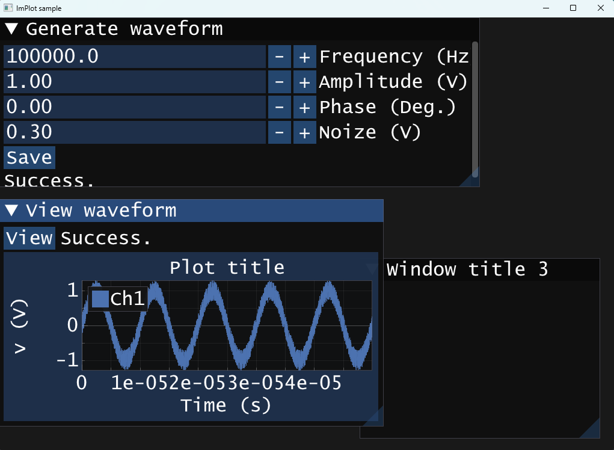
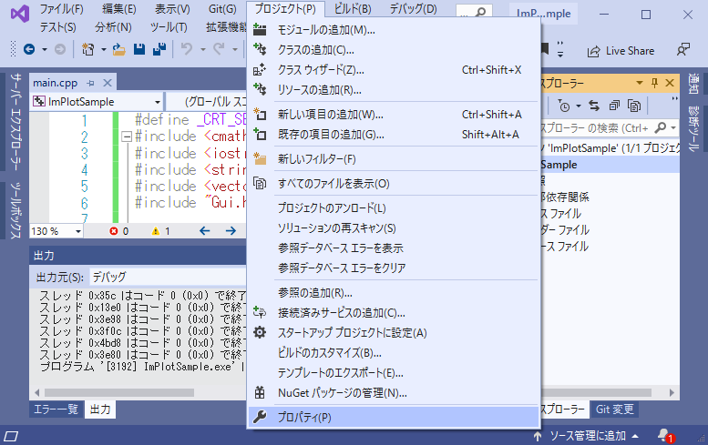
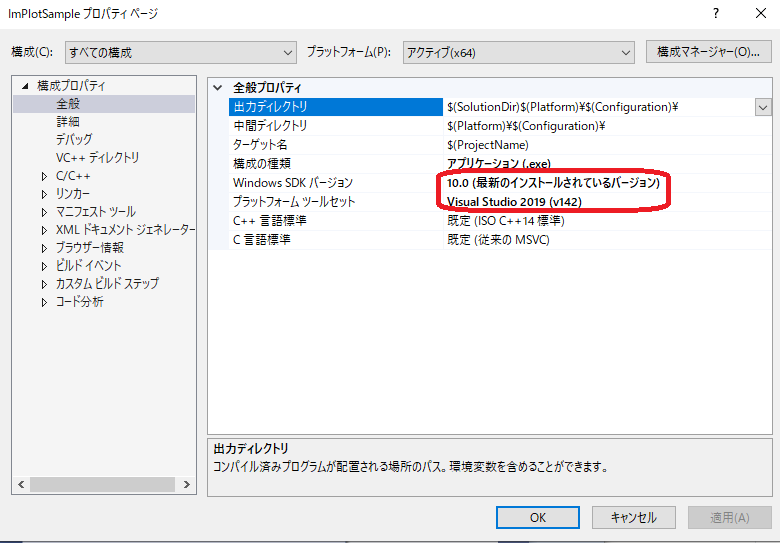
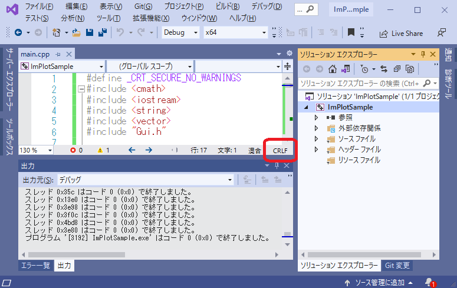

# 2.1. `rand`関数による雑音を含んだ模擬測定データの作成



---

## 1. 雑音とは？
- 偶然誤差としての雑音の例: $v(t)=A \sin(\omega t + \theta) \pm noize$
- 系統誤差としての雑音の例: $v(t)=A \sin(\omega t + \theta) + noize\times\sin(2\pi\times 50 t+\theta')$

---

## 2. サンプルプログラム
- ここでは雑音を含んだ信号を以下のように定義する:
  - $v(t)=A \sin(\omega t + \theta) + noize$
  - ただし、 $noize$ は「 $\pm$ 任意の値」のランダムな実数とする。
- Generate waveform window
	```cpp
	void ShowWindow1(const char title[]) {
	    static std::string text = "";
	    static double frequency = 100e3;
	    static double amplitude = 1.0;
	    static double phase_deg = 0.0, phase_rad = 0.0;
	    static double waveform[SIZE];
 	    static double noize = 0.0;
	    // ウィンドウ開始
	    ImGui::SetNextWindowPos(ImVec2(0, 0), ImGuiCond_FirstUseEver);
	    ImGui::SetNextWindowSize(ImVec2(800, 200), ImGuiCond_FirstUseEver);
	    ImGui::Begin(title);
	    /*** 描画したいImGuiのWidgetやImPlotのPlotをここに記述する ***/
	    ImGui::InputDouble("Frequency (Hz)", &frequency, 100.0, 1000.0, "%.1f");
	    ImGui::InputDouble("Amplitude (V)", &amplitude, 0.1, 1.0, "%.2f");
	    if (ImGui::InputDouble("Phase (Deg.)", &phase_deg, 0.1, 1.0, "%.2f")) {
	        phase_rad = phase_deg * PI / 180.0f;
	    }
	    ImGui::InputDouble("Noize (V)", &noize, 0.1, 1.0, "%.2f");
	    if (ImGui::Button("Save")) {
	        // ボタンが押されたらここが実行される
	        // 波形データ生成
 			/*** 適切なコードを入力 *************************************************/
	        srand(time(NULL));
	        for (int i = 0; i < SIZE; i++) {
	            waveform[i] = amplitude * std::sin(2 * PI * frequency * i * DT + phase_rad);
	            waveform[i] += (double)rand() / RAND_MAX * 2 * noize - noize;
	        }
 			/*** ここまで *************************************************/
	        // 保存
 			/*** 適切なコードを入力 *************************************************/
	        FILE* fp = fopen(FILENAME, "w");
	        if (fp != NULL) {
	            fprintf(fp, "# Time (s), Voltage (V)\n");
	            for (int i = 0; i < SIZE; ++i) {
	                fprintf(fp, "%e, %e\n", i * DT, waveform[i]);
	            }
	            fclose(fp);
	            text = "Success.\n";
	        }
	        else {
	            text = "[Error] Failed to open file for writing\n";
	        }
 			/*** ここまで *************************************************/
	    }
	    ImGui::SameLine();
	    ImGui::Text(text.c_str());
	    // ウィンドウ終了
	    ImGui::End();
	}
	```
- View waveform window
	```cpp
	void ShowWindow2(const char title[]) {
	    static std::string text = "";
	    static double times[SIZE], waveform[SIZE];
	    // ウィンドウ開始
	    ImGui::SetNextWindowPos(ImVec2(0, 200), ImGuiCond_FirstUseEver);
	    ImGui::SetNextWindowSize(ImVec2(640, 480), ImGuiCond_FirstUseEver);
	    ImGui::Begin(title);
	    /*** 描画したいImGuiのWidgetやImPlotのPlotをここに記述する ***/
	    if (ImGui::Button("View")) {
	        // ボタンが押されたらここが実行される
 			// 波形データ読み込み
	        /*** 適切なコードを入力 *************************************************/
	        FILE* fp = fopen(FILENAME, "r");
	        char buf[256];
	        if (fp != NULL) {
	            fgets(buf, sizeof(buf), fp);  // 1行目を読み飛ばす
	            for (int i = 0; i < SIZE; i++) {
	                fscanf(fp, "%lf,%lf", &times[i], &waveform[i]);
	            }
	            fclose(fp);
	            text = "Success.\n";
	        }
	        else {
	            text = "[Error] Failed to open file for reading\n";
	        }
	        ImPlot::SetNextAxesToFit();
	        /*** ここまで *************************************************/
	    }
	    ImGui::SameLine();
	    ImGui::Text(text.c_str());
	
	    // プロット描画
	    if (ImPlot::BeginPlot("Plot title", ImVec2(-1, -1))) {
	        ImPlot::SetupAxis(ImAxis_X1, "Time (s)");
	        ImPlot::SetupAxis(ImAxis_Y1, "v (V)");
	        ImPlot::PlotLine("Ch1", times, waveform, SIZE);
	        ImPlot::EndPlot();
	    }
	    
	    // ウィンドウ終了
	    ImGui::End();
	}
	```
---
## ダウンロードした`sln`がビルドできない場合

- 確認1: プロジェクトの設定
  1. メニューの「プロジェクト」⇒「プロパティ」をクリック
    
  1. 「構成プロパティ」⇒「全般」⇒「プラットフォームツールセット」⇒「Visual Studio 2019(v142)」が選択されていることを確認
    
- 確認2: 改行コード
  
  
