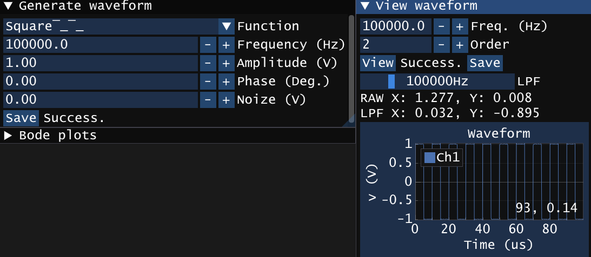

# 2.1. `rand`関数による雑音を含んだ模擬測定データの作成


---

## 1. 雑音とは？
- 偶然誤差としての雑音の例(ホワイトノイズ): $v(t)=A \sin(\omega t + \theta) + noize$
- 系統誤差としての雑音の例(商用電源からのノイズ): $v(t)=A \sin(\omega t + \theta) + noize\times\sin(2\pi\times 50 t+\theta')$

---

## 2. 課題
1. [サンプルプログラム](https://github.com/daigokk/ImPlotSample/archive/refs/heads/master.zip)をダウンロードして雑音を含んだ模擬測定データ(data.csv)を作成し、表示するプログラムを完成させてください。
   1. 「Save」ボタンを押すと「data.csv」ファイルに模擬測定データ(時間, 電圧)が保存される。
      - (例)データ数 N: 10000
      - (例)サンプリング間隔 DT: 1e-6 [s]
   1. 「View」ボタンを押すとWindowに模擬測定データの波形が表示される。
   1. ここでは雑音を含んだ信号を以下のように定義する:
      - $v(t)=A \sin(\omega t + \theta) + noize$
      - ただし、 $noize$ は「 $\pm$ 任意の値」のランダムな実数とする。
     
1. 加点例: 矩形波を作成する。
   - 矩形波: $v(t) = \sum_{i=0}^{\infty} \frac{4A}{(2i+1)\pi} \sin\left(2\pi f (2i+1) t\right)$
  
   
- Generate waveform window
	```cpp
	void ShowWindow1(const char title[]) {
	    static std::string text = "";
	    static double frequency = 100e3;
	    static double amplitude = 1.0;
	    static double phase_deg = 0.0, phase_rad = 0.0;
	    static double noize = 0.0; // 追加
	    static double fft[SIZE] = { 0 };
	    // ウィンドウ開始
	    ImGui::SetNextWindowPos(ImVec2(0, 0), ImGuiCond_FirstUseEver);
	    ImGui::SetNextWindowSize(ImVec2(660 * Gui::monitorScale, 220 * Gui::monitorScale), ImGuiCond_FirstUseEver);
	    ImGui::Begin(title);
	    /*** 描画したいImGuiのWidgetやImPlotのPlotをここに記述する ***/
	    ImGui::InputDouble("Frequency (Hz)", &frequency, 100.0, 1000.0, "%.1f");
	    ImGui::InputDouble("Amplitude (V)", &amplitude, 0.1, 1.0, "%.2f");
	    if (ImGui::InputDouble("Phase (Deg.)", &phase_deg, 0.1, 1.0, "%.2f")) {
	        phase_rad = phase_deg * PI / 180.0f;
	    }
	    ImGui::InputDouble("Noize (V)", &noize, 0.1, 1.0, "%.2f"); // 追加
	    if (ImGui::Button("Save")) {
	        // ボタンが押されたらここが実行される
	        srand(time(NULL));
	        FILE* fp;
	        fp = fopen("data.csv", "w");
	        if (fp != nullptr) {
	            fprintf(fp, "t (s), v (V)\n");
	            for (int i = 0; i < N; i++) {
	                double t = DT * i;
	                double v = amp * sin(2 * PI * freq * t + phase / 180 * PI);
	                v += ((double)rand() / RAND_MAX * 2 - 1) * noize;
	                fprintf(fp, "%f, %f\n", t, v);
	            }
	            fclose(fp);
	            text = "Success.";
	        }
	        else {
	            text = "Fail.";
	        }
	    }
	    ImGui::SameLine();
	    ImGui::Text(text.c_str());
	    // ウィンドウ終了
	    ImGui::End();
	}
	```

- View waveform window
  
	```cpp
	void ShowWindow2(const char title[]) {
	    static std::string text = "";
	    static double t[N], v[N];
	    // ウィンドウ開始
	    ImGui::SetNextWindowPos(ImVec2(100, 200), ImGuiCond_FirstUseEver);
	    ImGui::SetNextWindowSize(ImVec2(660 * Gui::monitorScale, 240 * Gui::monitorScale), ImGuiCond_FirstUseEver);
	    ImGui::Begin(title);
	    /*** 描画したいImGuiのWidgetやImPlotのPlotをここに記述する ***/
	    if (ImGui::Button("View")) {
	        // ボタンが押されたらここが実行される
	        FILE* fp;
	        fp = fopen("data.csv", "r");
	        if (fp != nullptr) {
	            char buf[256];
	            fgets(buf, sizeof(buf), fp);  // 1行目はラベル(t (s), v (V))なので読み飛ばす
	            for (int i = 0; i < N; i++) {
	                fscanf(fp, "%lf, %lf", &t[i], &v[i]);
	            }
	            fclose(fp);
	            text = "Success.";
	        }
	        else {
	            text = "Fail.";
	        }
	    }
	    ImGui::Text(text.c_str());
	    if (ImPlot::BeginPlot(title, ImVec2(-1, 250 * Gui::monitorScale))) {
	        ImPlot::PlotLine("Ch1", t, v, N);
	        ImPlot::EndPlot();
	    }
	    // ウィンドウ終了
	    ImGui::End();
	}
	```

---

## ※ ダウンロードした`sln`がビルドできない場合

- 確認1: プロジェクトの設定
  1. メニューの「プロジェクト」⇒「プロパティ」をクリック
    
  1. 「構成プロパティ」⇒「全般」⇒「プラットフォームツールセット」⇒「Visual Studio 2019(v142)」が使用しているバージョンに合わせて選択されていることを確認
    
- 確認2: 改行コード
  
  
