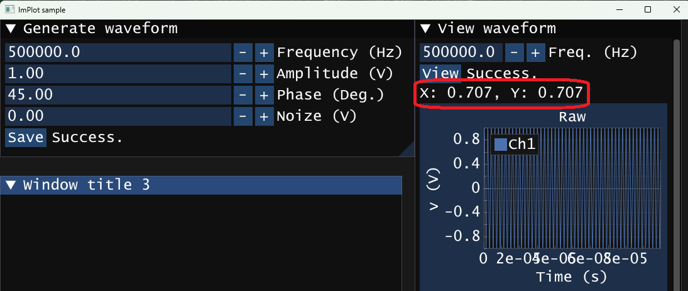

# 2.2. 位相敏感検波

---

## 1. 位相敏感検波とは？
位相感応検出 (PSD) または同期検出として知られる技術は、測定波形から既知の周波数の波形の振幅を求めるアルゴリズムです。

この検出技術の原理を下図に示します。[Youtube](https://www.youtube.com/watch?v=pHyuB1YW4qY)でも解説しています。


Amplitude: $A=\sqrt{x^2+y^2}$, Phase: $\theta=\arctan{\frac{y}{x}}$

---

## 2. サンプルプログラム
```cpp
#include <cmath>

#define PI acos(-1)

void psd(const double arr[], const double freq, const double dt, const int size, double* pX, double* pY) {
    *pX = 0; *pY = 0;
    // 掛け算
    for (int i = 0; i < size; i++) {
        double wt = 2 * PI * freq * dt * i;
        *pX += arr[i] * 2 * sin(wt);
        *pY += arr[i] * 2 * cos(wt);
    }
    // ローパスフィルタの代わりに平均を用いる
    *pX /= size;
    *pY /= size;
}
```

- `arr[]`: 入力信号（測定波形）
- `freq`: 検出したい周波数（Hz）
- `dt`: サンプリング間隔（秒）
- `size`: サンプル数
- `pX`, `pY`: 出力される直交成分のポインタ
- 平均を取ることで高周波($2\omega$)成分が打ち消され、ローパスフィルタの代替として機能します。
- 引数が多くて面倒ですね。もっと使いやすく実装できないでしょうか。構造体を使うとできます✨
- [C++を使うと計算速度とソースコードの見通しの良さを両立しやすくなります。](https://github.com/daigokk/LIA/blob/master/LIA/Psd.h)

---

## 3. 注意点
- ローパスフィルタを平均で代用する場合、検波周波数の1/2周期の整数倍の時間で平均しなければ大きな誤差が生じる場合がある。

---

## 4. 課題
- 「2.1. rand関数による雑音を含んだ模擬測定データの作成」で作った波形に対してPSDを適用し、振幅と位相を表示する。

