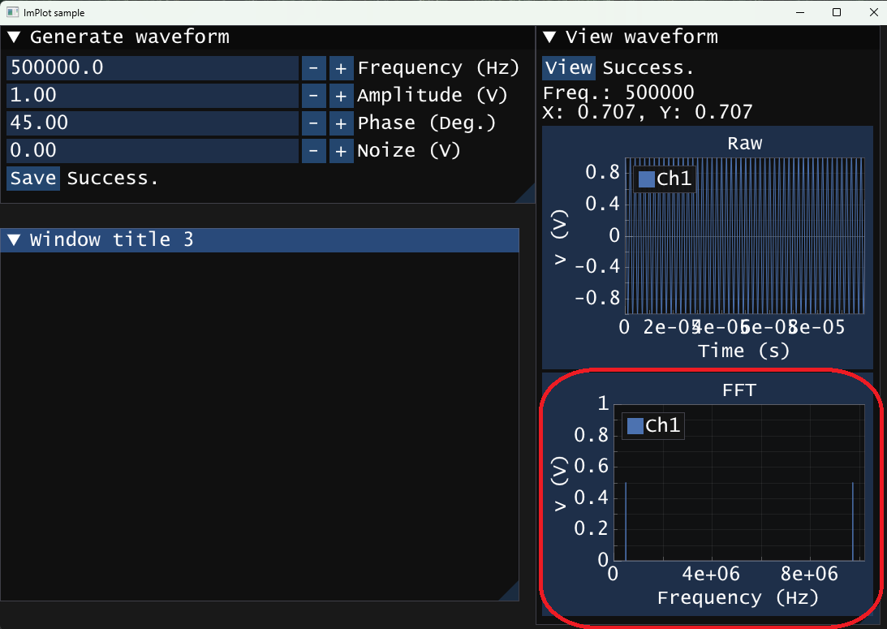

# 2.3. FFT

## 1. FFTってなに？
- **高速フーリエ変換**のこと。信号処理や周波数解析(スペクトル解析)など、電気系の分野でよく使われます。
- **バラフライ演算**と再帰演算により、高速に周波数解析が可能です。
- [おすすめ解説動画1](https://www.youtube.com/watch?v=fGos3wrKeHY), [おすすめ解説動画2](https://www.youtube.com/watch?v=7hzIhtbxhtM), [原著論文](https://www.cs.jhu.edu/~misha/ReadingSeminar/Papers/Cooley65.pdf)



---

## 2. サンプルプログラム

```cpp
void fft(std::vector<std::complex<double>>& a) {
    int N = a.size();
    if (N <= 1) return;

    // 偶数・奇数に分割 配列のサイズが半分になる！！！
    std::vector<std::complex<double>> even(N / 2), odd(N / 2);
    for (int i = 0; i < N / 2; ++i) {
        even[i] = a[i * 2];
        odd[i] = a[i * 2 + 1];
    }

    // 再帰呼び出し
    fft(even);
    fft(odd);

    // 合成: バラフライ演算
    for (int k = 0; k < N / 2; ++k) {
        std::complex<double> t = std::polar(1.0, -2 * PI * k / N) * odd[k];
        a[k] = even[k] + t;
        a[k + N / 2] = even[k] - t;
    }
}
```
- アルゴリズム
  1. 信号を偶数番目と奇数番目に分割する。
  2. 再帰的に１を配列サイズが１になるまで適用する。
  3. 偶数番目と奇数番目の結果を**組み合わせる**。
- 6行目の`std::vector<std::complex<double>> even(N / 2), odd(N / 2);`から、入力データ`a`のサイズが2のべき乗であることを期待していることがわかります。なぜなら奇数だと値が失われてしまうからです。
- `std::vector<>`は任意の型の可変長配列を作ることができる、とても便利(例えば、プログラムの途中で配列のサイズを変える、関数に配列とそのサイズを一つの引数で渡すことができる、等)なC++の機能の一つです。
- 13行目で自分自身(`fft`)を呼び出しています。これを**再帰呼び出し**と言います。このような関数を再帰関数と呼びます。
- 最後の`for`ブロックのバラフライ演算とは、`even[k]`と`odd[k]`を使って、回転因子`std::polar(1.0, -2πk/N)`を掛けて、加算と減算で結果を合成しているところを指しています。この「加算・減算・回転因子」の組み合わせが、バタフライの形に似てると言われています。polar関数は複素数を極形式で指定して作る関数です。
  ```
  even[k] ──┐        ┌── a[k]
            ├─ 加算 ─┤
  odd[k]  ──┘        └── a[k + N/2]
  ```
- このサンプルプログラムは、再帰のたびにメモリを確保します。これを改善するアルゴリズム(`in-place`)を使うと、省メモリと高速化が両立できます。若干プログラムが複雑になるのでここではこの程度の紹介にとどめておきますが、`FFT`と`in-place`はセットで覚えておいてください。

---

## 3. 注意点

- 入力データのサイズは2のべき乗でなければいけない。
- FFTの出力は左右(配列前半と後半が)対称になるため、周波数分析に使うのは前半だけ。
- したがって、FFTの出力は0Hzからナイキスト周波数(サンプリング周波数の1/2の周波数、出力の真ん中)までの実数成分と虚数成分。
- 出力の振幅は元のデータより小さくなっているように見える。つまり振幅を求めるには補正が必要(どのような？)。ただしDC成分(両端)とナイキスト成分(真ん中)は補正をせずにそのまま用いる。
- じつは入力も複素数。今回の入力は虚数成分が0の複素数を用いている。
- FFTは入力信号が周期的であると仮定して解析するため、入力信号の両端の値が不連続だと不備がある(どのような？)。
- 二次元に応用すると画像を周波数成分に分解することができる。

---

## 4. レポート課題

1. 100kHzの正弦波の振幅の周波数スペクトルのグラフにしてください。
   - 加点例: 100kHzの矩形波の振幅を周波数スペクトルのグラフにしてください。
     - 矩形波: $f(t) = \sum_{n=1}^{\infty} \frac{2}{n\pi} \sin\left( \frac{n\pi \tau}{T} \right) \cdot \sin\left( \frac{2\pi n t}{T} \right)$
3. 逆FFTは周波数スペクトルを入力すると波形を出力します。FFTと逆FFTのコードの違いを指摘してください。
   - 加点例: FFTに周波数スペクトルをの入力したときの出力と比較する。
1. 入力データの両端の値が不連続(入力信号の測定時間が被測定波形の周期で割り切れない)の場合、どのような影響(どのようなノイズ)が出るでしょうか？
   - 加点例: ノイズを軽減するWindow関数について調べる。
1. 入力データのサイズを2のべき乗に限定せず、任意とするための方法を提案してください。
   - 加点例: 提案を実装する。

- 逆FFT
    ```cpp
    void ifft(std::vector<std::complex<double>>& a) {
        int N = a.size();
        if (N <= 1) return;
    
        // 偶数・奇数に分割
        std::vector<std::complex<double>> even(N / 2), odd(N / 2);
        for (int i = 0; i < N / 2; ++i) {
            even[i] = a[i * 2];
            odd[i]  = a[i * 2 + 1];
        }
    
        // 再帰呼び出し
        ifft(even);
        ifft(odd);
    
        // 合成（回転因子polarの引数の符号が正）
        for (int k = 0; k < N / 2; ++k) {
            std::complex<double> t = std::polar(1.0, 2 * PI * k / N) * odd[k];
            a[k]       = even[k] + t;
            a[k + N/2] = even[k] - t;
        }
    
        // スケーリング（1/N）
        if (N == a.size()) {
            for (int i = 0; i < N; ++i) {
                a[i] /= N;
            }
        }
    }
    ```
