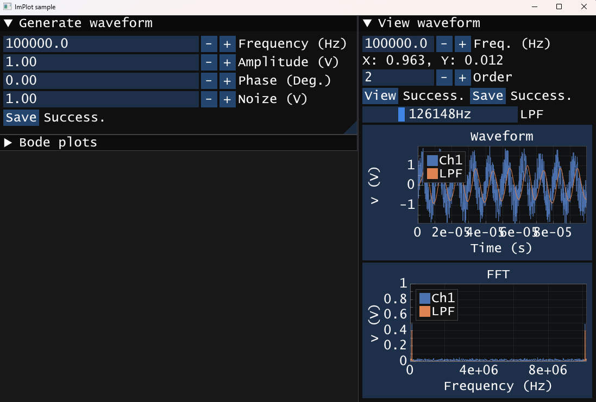
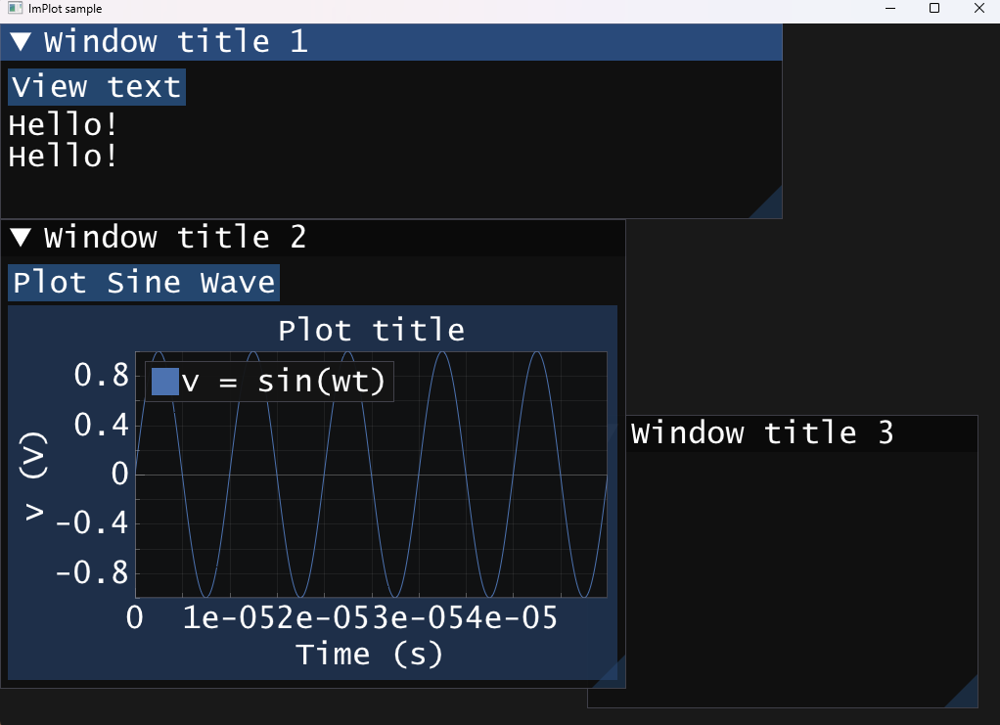

# 2.4. 周波数フィルター

## 1. 周波数フィルターとは？

任意の周波数成分のみを透過する電子回路、あるいはアルゴリズムを指します。フィルターに求められる性能を以下にまとめます。
- カットオフ周波数を境に、急峻に振幅が減衰する。
- カットオフ周波数付近の位相変化が小さい。

ここでは「通過域ができるだけ平坦」になるように設計されたアルゴリズムであるButterworthフィルターについて説明します。

### Butterworthフィルタの数式（アナログ）

#### 🔹 振幅特性（ゲイン）：

$$
|H(j\omega)| = \frac{1}{\sqrt{1 + \left( \frac{\omega}{\omega_c} \right)^{2n}}}
$$

- $\omega$：角周波数（rad/s）
- $\omega_c$：カットオフ周波数
- $n$：フィルターの次数（高いほど急峻）

---

#### 🔹 特徴

- 通過域 $(\omega < \omega_c)$ ではゲイン ≈ 1
- 遮断域 $(\omega > \omega_c)$ では急激に減衰
- $n$が大きいほど、**理想的なフィルタに近づく**！

---

### 💻 離散化(1次Butterworth LPF)

デジタルフィルタでは、Z変換を使うと以下のように表せます：

$$
H(z) = \frac{Y(z)}{X(z)} = \frac{a_0 + a_1 z^{-1}}{1 + b_1 z^{-1}}
$$

これは、入力 **X(z)** に対して出力 **Y(z)** を得るためのフィルタの周波数応答を表します。

この係数 $a_0, a_1, b_1$ を**Butterworth特性に合わせて設計**することで、デジタルButterworthフィルタが完成します。

---

### 🎯 1次のデジタル Butterworth ローパスフィルター（簡易版）

$$
y[n] = a_0 x[n] + a_1 x[n-1] - b_1 y[n-1]
$$

ここで：
- $x[n]$：現在の入力
- $x[n-1]$：1つ前の入力
- $y[n]$：現在の出力
- $y[n-1]$：1つ前の出力
- 係数$a_0, a_1, b_1$はカットオフ周波数とサンプリング周波数から計算

---

## 2. サンプルプログラム



```cpp
#include <cmath>
#define PI acos(-1)

class FirstOrderStage {
public:
    FirstOrderStage(double cutoffFreq, double sampleRate) {
        // プリワーピングを行い、正規化されたカットオフ角周波数を計算
        double wc_warped = tan(PI * cutoffFreq / sampleRate);

        // 双一次変換に基づいて係数を計算
        a0 = wc_warped / (1.0 + wc_warped);
        a1 = a0;
        b1 = (wc_warped - 1.0) / (1.0 + wc_warped);

        // 状態変数を初期化
        prevInput = 0.0;
        prevOutput = 0.0;
    }

    double process(double input) {
        double output = a0 * input + a1 * prevInput - b1 * prevOutput;
        prevInput = input;
        prevOutput = output;
        return output;
    }

private:
    double a0, a1, b1;
    double prevInput, prevOutput;
};
```


## 3. 特徴
- リップルがない: Butterworthフィルターは通過域にリップル（波打ち）がなく、滑らかな減衰特性を持ちます。これはChebyshevフィルターとの大きな違いです。
- 元の波形からローパスフィルターのアウトプットを引くと、疑似的なハイパスフィルターが得られます。

## 4. レポート課題
1. カットオフ周波数100kHzとして、一から三次での10kHzから1000kHzまでの周波数特性をボード線図(Gainと位相$\theta$)で示せ。
   - $Gain = 20 \log_{10}\frac{𝑉_{𝑜𝑢𝑡}}{𝑉_{𝑖𝑛}}$ [dB]
   - $\theta = \theta_{out} - \theta_{in}$ [Deg.]
   - 加点例: ハイパスフィルター、またはバンドパスフィルターを実装せよ。
   ```cpp
    void ShowWindow3(const char title[]) {
        static double freqs[] = { FREQS }, gains[N_TH][N_FREQS] = { 0 }, phases[N_TH][N_FREQS];
        static Commands::WaveformParams wfp;
        static std::string text = "";
        // ウィンドウ開始
        ImGui::SetNextWindowPos(ImVec2(0, 240 * Gui::monitorScale), ImGuiCond_FirstUseEver);
        ImGui::SetNextWindowSize(ImVec2(660 * Gui::monitorScale, 530 * Gui::monitorScale), ImGuiCond_FirstUseEver);
        ImGui::Begin(title);
        /*** 描画したいImGuiのWidgetやImPlotのPlotをここに記述する ***/
        if (ImGui::Button("Run")) {
            // ボタンが押されたらここが実行される
            wfp.amplitude = 1;
            wfp.dt = DT;
            wfp.size = SIZE;
            // 周波数特性
            /*** 適切なコードを入力 ***************************************/

            
            /*** ここまで *************************************************/
        }
        ImGui::SameLine();
        ImGui::Text(text.c_str());
        ImPlot::SetNextAxesToFit();
        if (ImPlot::BeginPlot("Gain", ImVec2(-1, 225 * Gui::monitorScale))) {
            ImPlot::SetupAxisScale(ImAxis_X1, ImPlotScale_Log10);
            ImPlot::SetupAxis(ImAxis_X1, "Frequency (Hz)");
            ImPlot::SetupAxis(ImAxis_Y1, "Gain (dB)");
            for (int j = 0; j < N_TH; j++) {
                std::string label = "Order " + std::to_string(j + 1);
                ImPlot::PlotLine(label.c_str(), freqs, gains[j], N_FREQS);
            }
            ImPlot::EndPlot();
        }
        ImPlot::SetNextAxesToFit();
        if (ImPlot::BeginPlot("Phase", ImVec2(-1, 225 * Gui::monitorScale))) {
            ImPlot::SetupAxisScale(ImAxis_X1, ImPlotScale_Log10);
            ImPlot::SetupAxis(ImAxis_X1, "Frequency (Hz)");
            ImPlot::SetupAxis(ImAxis_Y1, "Phase (Deg.)");
            for (int j = 0; j < N_TH; j++) {
                std::string label = "Order " + std::to_string(j + 1);
                ImPlot::PlotLine(label.c_str(), freqs, phases[j], N_FREQS);
            }
            ImPlot::EndPlot();
        }
        // ウィンドウ終了
        ImGui::End();
    }
   ```
   
