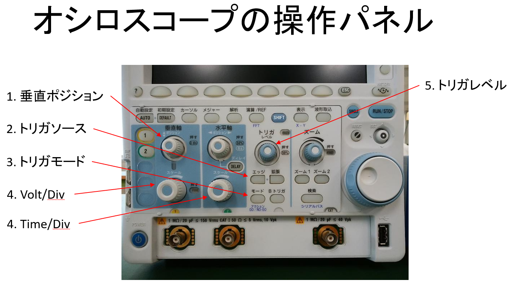

# 3.1. 計測器の手動操作

## 1. 試験
5分以内に10回、連続波の静像を得る。

1. オシロスコープとファンクションジェネレータを同軸ケーブルで接続する。
   - FG Func Out => Scope Ch1
1. オシロスコープとファンクションジェネレータをUSBケーブルでPCと接続する。
1. Oscilloscope trainer.exeを実行
1. 垂直ポジション:		0V
1. トリガソース:		Ch1
1. トリガモード: 最初はAutoにする。波形が見えて、その周波数が50Hz以下の時はNormalにする。
1. Volt/Div, Time/Div: 振幅が表示範囲の1/3以上で、1周期以上10周期以下で表示されていること。
1. トリガレベル:		振幅の範囲内にあること。

