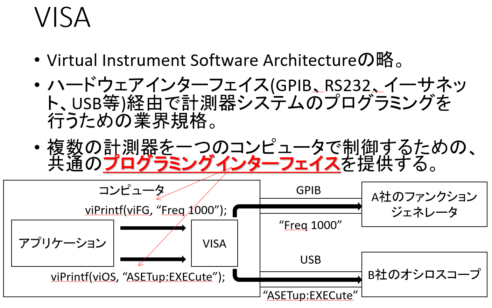

# 🧪 3.2. 計測器の共通言語！VISAとは？



## 概要: 万能アダプターとしてのVISA

VISA（Virtual Instrument Software Architecture、ビサ）は、計測器とコンピュータをつなぐための**万能アダプター**や**翻訳家**のような役割を果たすソフトウェアインターフェース規格です。

もしVISAがなければ、USB機器、LAN機器、または古いGPIB機器を制御するために**それぞれ異なる通信方式専用のコード**を書く必要がありました。

VISAは、異なる通信方法の違いを気にせず、**同じ操作方法**でどのメーカーの、どの通信方式の機器でも統一的に操作できるようにします。[計測機業界の主要メンバー](https://www.ivifoundation.org/About-the-Foundation/Current-Members.html#sponsor-members)で構成された[IVI Foundation](https://www.ivifoundation.org/)で制定され、多くの計測器メーカーが採用している業界標準です。
* VISAの実装(ソフトウェア)の例
  - [NI-VISA](https://www.ni.com/ja/support/downloads/drivers/download.ni-visa.html)
  - [KeySight VISA](https://www.keysight.com/jp/ja/lib/software-detail/computer-software/io-libraries-suite-downloads-2175637.html)
  - [TekVISA](https://www.tek.com/ja/manual/tekvisa-programmer-manual)
  - [KI-VISA](https://kikusui.co.jp/dri-fir-upd/ki-visa/)
* VISAに対応している計測器メーカー
  - Keysight Technologies
  - NI
  - Tektronix
  - RIGOL
  - 菊水電子工業(株)
  - (株)エヌエフ回路設計ブロック
  - 横河計測(株)
  - その他多数

---

## デモンストレーション
1. ゲーム感覚でオシロスコープの操作方法を習得するプログラム
1. 複数のオシロスコープをネットワーク経由で操作するプログラム

---

## 🎯 VISAの目的（なぜ必要？）

* **接続方式の統一:** 異なる通信方式（**GPIB, USB, LAN**など）を**統一的なAPI** (Application Programming Interface)で扱えるようにします。
* **制御の簡素化:** 難しい通信プロトコルの詳細を隠蔽し、計測器の制御を劇的に簡単にします。
* **標準化:** 複数ベンダー（メーカー）の機器を、ほぼ同じコードで制御することを可能にします。

---

## 📡 対応する主な通信方式

| 通信方式 | 説明 |
| :--- | :--- |
| **RS-232** | シリアル通信。古めの機器やシンプルなデータ送受信によく使われます。 |
| **GPIB** | **計測器の世界で長く使われてきたとても太いケーブルを用いる接続規格**（旧HP社、現Keysight Technologies社が開発）。古い規格ではありますが非常に堅牢な接続性が求められる機器でいまだに使用されています。 |
| **USB** | USBTMC（Test & Measurement Class）という規格に対応した機器の接続に使われます。 |
| **TCP/IP (LAN)** | ネットワーク経由での通信。遠隔地からの制御や高速データ転送に使われます。 |
| **PXI/VXI** | モジュール型の計測器システムで使われる、内部的な高速接続規格です。 |

---

## 🧰 主なVISA関数（C/C++での役割）

VISA関数は、計測器を操作する際の「手順」を**身近な動作**に置き換えて考えると分かりやすいです。

| 関数名 | 役割（比喩） | 説明 |
| :--- | :--- | :--- |
| `viOpenDefaultRM` | **オフィスに入る** | VISAを動かすための親玉（リソースマネージャ）を初期化します。PCに接続された全ての計測器を管理・統括する存在です。 |
| `viFindRsrc` | **名刺を探す** | 接続されている利用可能な計測器（リソース）を検索します。 |
| `viOpen` | **ドアを開ける** | 特定の計測器（リソース）との接続を確立します。 |
| `viWrite` | **話しかける** | コマンド（命令）を計測器へ送信します。 |
| `viRead` | **返事を聞く** | 計測器からの応答データを受信します。 |
| `viPrintf` | **丁寧な手紙を書く** | `viWrite`の仲間。**C言語の`printf`のように**、変数などの内容を整形してテキストコマンドとして送信します。 |
| `viScanf` | **届いた手紙を読む** | `viRead`の仲間。**C言語の`scanf`のように**、受信したテキストデータから数値や文字列を読み取って変数に格納します。 |
| `viQueryf` | **質問して答えを聞く** | `viPrintf`（質問）と`viScanf`（応答）を連続して実行する**便利な機能**です。計測器制御で最も頻繁に使われます。 |
| `viClose` | **さよならする** | 接続を終了します。 |

---

## 📄 SCPI（スキッピ）との関係

[SCPI](https://www.ivifoundation.org/About-IVI/scpi.html)(Standard Commands for Programmable Instruments)はVISAと同じくIVI Foundationによって管理されているプログラマブルな試験機・計測機の制御に用いる文法の標準です。VISAとよく混同されますが、これらは役割が違います。

* **VISA:** 「**手紙の届け方**（郵送、宅配便、電子メール）」を統一する仕組み。
* **SCPI** : 「**手紙の中身**（命令や用件）」を標準化する仕組み。

例えば、`*IDN?` というSCPIコマンドは「あなたは誰ですか？」という意味で、メーカー名や型番などを返します。**VISA(例えばviQueryf関数)を使えば、SCPIコマンド(例えば`*IDN?`)を、USBでもLANでも同じように送れるのです。**

SCPIコマンドを使えば、異なる計測器メーカーでも同じ結果が期待できます。**しかしながら計測器メーカーごとに方言が存在するのでマニュアルを確認することが必要です。**

* 異なる計測器メーカーでも同じ結果が期待できるSCPI`*IDN?`の使用例:
  ```cpp
  char ret[256];
  viQueryf(vi, "%s", "%255t", "*IDN?\n", ret);
  printf("IDN: %s", ret);
  ```
* 計測器メーカーのSCPIの方言の例: オシロスコープのTime/divの問い合わせ
  * 横河計測 DLM2022([マニュアル](https://cdn.tmi.yokogawa.com/IM710105-17.jp.pdf)): `TIMebase:TDIV?`
  ```cpp
  char ret[256];
  viQueryf(vi, "%s", "%255t", "TIMebase:TDIV?\n", ret);
  printf("Time/div: %f", atof(ret));
  ```
  * Tektronix: `HORizontal:SECdiv?`
    ```cpp
    char ret[256];
    viQueryf(vi, "%s", "%255t", "HORizontal:SECdiv?\n", ret);
    printf("Time/div: %f", atof(ret));
    ```

-----

## 🏠 VISAアドレスの例: 計測器の「住所」

VISAは、接続方法に関わらず計測器に一意の「住所」を割り当てます。

| アドレス形式 | 意味 | 構成要素の解説 |
| :--- | :--- | :--- |
| `GPIB0::5::INSTR` | GPIBバスの5番ポート | `GPIB0`: バスの番号。`5`: 計測器の番地。`INSTR`: リソースタイプ（計測器）。 |
| `USB0::0x1234::0x5678::INSTR` | USB接続の機器 | `USB0`: USBインターフェース。`0x1234`,`0x5678`: ベンダー/プロダクトIDなど。 |
| `TCPIP0::192.168.0.10::INSTR`| LAN接続の機器 | `TCPIP0`: TCP/IPインターフェース。`192.168.0.10`: IPアドレス。 |
| `TCPIP0::192.168.0.10::12345::SOCKET`| Raw socket LAN接続の機器。PC<=>PCの通信にも使用可 | `TCPIP0`: TCP/IPインターフェース。`192.168.0.10`: IPアドレス。 `12345`: Port番号。 |

-----

## 🧭 補助ツール: NI MAX

  * **NI MAX (Measurement & Automation Explorer)**
    Emerson社のNI(旧Natinal Instruments社)が提供するVISAのためのGUIツール。接続された計測器の**VISAアドレスの確認**、**接続テスト**、デバッグに非常に便利です。VISAを導入したら、まずこのツールで機器が認識されているか確認するのが一般的です。


  * 以下は接続された計測器を列挙するプログラムです。NI MAXも内部で以下のようにVISAを使っています。
    ```cpp
    void vi_getIdn(const ViSession resourceManager, const ViChar* instrDesc, char* ret) {
        ViSession instrument;
        viOpen(resourceManager, instrDesc, VI_NULL, VI_NULL, &instrument);
        viQueryf(instrument, "%s", "%255t", "*IDN?\n", ret);
        viClose(instrument);
    }
    
    void vi_FindRsrc() {
        // 接続されている計測器のアドレスとメーカ名等を列挙する
        ViSession defaultRM;
        ViFindList findList;
        ViUInt32 numInstrs;
        ViChar instrDesc[256], ret[256];
        
        viOpenDefaultRM(&defaultRM);
        // 接続されている計測器を検索（例: GPIB, USB, TCPIPなど）
        viFindRsrc(defaultRM, "?*INSTR", &findList, &numInstrs, instrDesc);
        printf("見つかった計測器の数: %d\n", numInstrs);
        if(numInstrs == 0) {
            std::cout << "計測器が見つかりませんでした。" << std::endl;
            return;
        }
        
        // 最初の計測器を表示
        vi_getIdn(defaultRM, instrDesc, ret);
        printf("1: %s, %s\n", instrDesc, ret);
    
        // 残りの計測器を取得
        for (ViUInt32 i = 1; i < numInstrs; ++i) {
            if (viFindNext(findList, instrDesc) < VI_SUCCESS) break;
            vi_getIdn(defaultRM, instrDesc, ret);
            printf("%d: %s, %s\n", i + 1, instrDesc, ret);
        }
        
        viClose(findList);
        viClose(defaultRM);
    }
    ```
    - `findList`: 検索結果（アドレスリスト）全体を管理するための**識別子（ハンドル）**が格納されます。残りの計測器のアドレスを取得するために、後続のviFindNext関数に渡されます。
    - `numInstrs`: 検索条件に一致した計測器の総数が格納されます。この値に基づいてviFindNextのループ回数を決定します。
    - `instrDesc`: 検索で見つかった**最初の計測器のVISAアドレス**が格納されます。
-----

## 🔧 最小のサンプルプログラム

このC言語のサンプルは、**VISAによる通信がどのような手順を踏んでいるか**を示すものです。

```cpp
// このサンプルは、いずれかの通信方式で接続されたSCPI対応機器に対して識別情報を取得する最小構成の例です。
// ビルドするにはVISAと同時にインストールされる`visa.h`、`visatype.h`及び`visa64.lib`(または`visa32.lib`)が必要です。
// 'C:\Program Files\IVI Foundation\VISA\Win64'フォルダの中にあります。
// "USB0::????????::INSTR" の部分は、NI MAXで確認した実際のアドレスに置き換えてください。

#pragma comment(lib, "visa64.lib")
#include <visa.h>
#include <stdio.h>

int main() {
    ViSession defaultRM, instr;
    char buffer[256] = {0};

    // 1. オフィスに入る（リソースマネージャ初期化）
    viOpenDefaultRM(&defaultRM); 

    // 2. ドアを開ける（計測器に接続）
    viOpen(defaultRM, "USB0::????????::INSTR", VI_NULL, VI_NULL, &instr); 
    
    // 3. 質問する（SCPIコマンド、ここでは*IDN?を送信）
    viPrintf(instr, "*IDN?\n");
    
    // 4. 答えを聞く（直前のSCPIコマンドに対する返信を受信）
    viScanf(instr, "%255t", buffer);
    
    printf("Instrument ID: %s\n", buffer); // 結果表示
    
    // 5. さよならする（接続を閉じる）
    viClose(instr); 
    viClose(defaultRM);
    
    return 0;
}
```

-----

## 🐍 Python (PyVISA)でのサンプルプログラム

C言語と同様の手順を、近年よく使われるPythonで行う例です。`pyvisa`というライブラリを使うと、よりシンプルに記述できます。

```python
# pip install pyvisa-py でライブラリをインストールしておく必要があります
# "USB0::????????::INSTR" の部分は、NI MAXで確認した実際のアドレスに置き換えてください。

import pyvisa

# 1. オフィスに入る（リソースマネージャ初期化）
rm = pyvisa.ResourceManager()

# 2. ドアを開ける（計測器に接続）
# Pythonでは、接続を閉じる処理を忘れないように with構文 を使うのが一般的です
with rm.open_resource("USB0::????????::INSTR") as instr:

    # 3 & 4. 質問して答えを聞く
    # .query() は、コマンドの送信(Write)と応答の受信(Read)を一度に行う便利な命令です
    response = instr.query("*IDN?")
    
    print(f"Instrument ID: {response.strip()}") # 結果表示

# 5. さよならする (with構文を使ったため、withブロックを抜ける際に自動で接続が閉じられます)
print("接続を終了しました。")

```

-----

## 🧠 まとめ

VISAは、現代の計測器制御において**必須の共通言語**です。複雑な通信方式の壁を取り払い、統一されたシンプルな手順（API）で機器を扱えるようにすることで、開発効率と保守性を大幅に向上させています。

