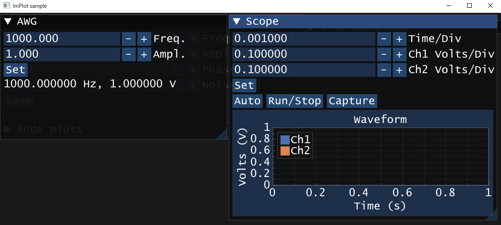

# 計測器（ファンクションジェネレータやオシロスコープなど）への設定の書き込み、及び読み込み

## 課題1
ファンクションジェネレータ及びオシロスコープの操作パネルをPCの画面上に再現する。



1. ImGuiのウィジェットを使ってPCに操作パネルを再現する。
1. 計測器のマニュアルから該当するコマンドを探す。
   * 横河計測DL2022 [マニュアル](https://cdn.tmi.yokogawa.com/IM710105-17.jp.pdf)
   * NF回路設計ブロックWF1973 [マニュアル](https://www.nfcorp.co.jp/files/WF1973_74_InstructionManual_ExternalControl_Jp.pdf)
1. main関数の最初と最後にVISAのリソースマネージャーの初期化と終了処理を追加する。

	```cpp
	int main() {
		ViSession defaultRM, awg, scope;
		viOpenDefaultRM(&defaultRM);
		viOpen(defaultRM, "USB0::ここにはNI MAXで調べたVISAアドレスを入力する::INSTR", VI_NULL, VI_NULL, &awg);
		viOpen(defaultRM, "USB0::ここにはNI MAXで調べたVISAアドレスを入力する::INSTR", VI_NULL, VI_NULL, &scope);
	
		/* 途中省略 */
	
		viClose(scope);
		viClose(awg);
		viClose(defaultRM);
	}
	```

1. ImGuiのウィジェットにコマンドを割り当てる。

	```cpp
	void ShowWindow4(const ViSession awg) {
	    // ウィンドウ開始
	    ImGui::SetNextWindowSize(ImVec2(500 * Gui::monitorScale, 450 * Gui::monitorScale), ImGuiCond_FirstUseEver);
	    ImGui::Begin("AWG");
	    /*** 描画したいImGuiのWidgetやImPlotのPlotをここに記述する ***/
	    static float freq = 1000, ampl = 1;
	    ImGui::InputFloat("Freq.", &freq, 1, 1);
	    ImGui::InputFloat("Ampl.", &ampl, 1, 1);
	    if(ImGui::Button("Set")){
	        /*** 48ページ, 「2.3.20 周波数 設定/問合せ」参照 ***/
	        /*** https://www.nfcorp.co.jp/files/WF1973_74_InstructionManual_ExternalControl_Jp.pdf ***/
	        char ret[256];
	        viPrintf(awg, ":SOURce1:FREQuency %e\n", freq);
	        viQueryf(awg, ":SOURce1:FREQuency?\n", "%255t", ret);
	        freq = atof(ret);
	        /*** 50ページ, 「2.3.23 振幅 設定/問合せ」参照 ***/
	        viPrintf(awg, "XXXXXXXXXXXXXXX %e\n", ampl);
	        viQueryf(awg, "XXXXXXXXXXXXXXX?\n", "%255t", ret);
	        ampl = atof(ret);
	    }
	    ImGui::SameLine();
	    if (ImGui::Button("Out")) {
	        static bool state = false;
	        if (state) {
	            /*** 42ページ参照 ***/
	            viPrintf(awg, "XXXXXXXXXXXXXXX OFF\n");
	        }
	        else {
	            /*** 42ページ参照 ***/
	            viPrintf(awg, "XXXXXXXXXXXXXXX ON\n");
	        }
	        state = !state;
	    }
	    ImGui::Text("%f Hz, %f V", freq, ampl);
	    // ウィンドウ終了
	    ImGui::End();
	}
	
	void ShowWindow5(const ViSession scope) {
	    // ウィンドウ開始
	    ImGui::SetNextWindowSize(ImVec2(500 * Gui::monitorScale, 450 * Gui::monitorScale), ImGuiCond_FirstUseEver);
	    ImGui::Begin("Scope");
	    /*** 描画したいImGuiのWidgetやImPlotのPlotをここに記述する ***/
	    static double tdiv = 1e-3, vdiv1 = 0.1, vdiv2=0.1;
	    ImGui::InputDouble("Time/Div", &tdiv, 1, 1);
	    ImGui::InputDouble("Ch1 Volts/Div", &vdiv1, 1, 1);
	    ImGui::InputDouble("Ch2 Volts/Div", &vdiv2, 1, 1);
	    if (ImGui::Button("Set")) {
	        /*** 5-238, 5-79ページ参照 ***/
	        /*** https://cdn.tmi.yokogawa.com/IM710105-17.jp.pdf ***/
	        viPrintf(scope, "XXXXXXXXXXXXXXX %e\n", tdiv);
	        viPrintf(scope, "XXXXXXXXXXXXXXX %e\n", vdiv1);
	        viPrintf(scope, "XXXXXXXXXXXXXXX %e\n", vdiv2);
	    }
	    if (ImGui::Button("Auto")) {
	        /*** 5-75ページ参照 ***/
	        viPrintf(scope, "XXXXXXXXXXXXXXX\n");
	    }
	    ImGui::SameLine();
	    if (ImGui::Button("Run/Stop")) {
	        static bool state = true;
	        if (state) {
	            /*** 5-234ページ参照 ***/
	            viPrintf(scope, "XXXXXXXXXXXXXXX\n");
	        }
	        else {
	            /*** 5-232ページ参照 ***/
	            viPrintf(scope,"XXXXXXXXXXXXXXX\n");
	        }
			state = !state;
	    }
	    ImGui::SameLine();
	    static std::vector<double> times, voltages[2];
	    if (ImGui::Button("Capture")) {
			/*** ここから *************************************************/
	    
	        /*** ここまで *************************************************/
	    }
	    ImPlot::SetNextAxesToFit();
	    if (ImPlot::BeginPlot("Waveform", ImVec2(-1, -1))) {
	        ImPlot::SetupAxis(ImAxis_X1, "Time (s)");
	        ImPlot::SetupAxis(ImAxis_Y1, "Volts (V)");
	        ImPlot::PlotLine("Ch1", times.data(), voltages[0].data(), times.size());
	        ImPlot::PlotLine("Ch2", times.data(), voltages[1].data(), times.size());
	        ImPlot::EndPlot();
	    }
	    // ウィンドウ終了
	    ImGui::End();
	}
	```

## (追加)課題2
オシロスコープにマイクを接続して、声の波形とそのFFT結果をPCの画面上に表示する。
1. 声の信号成分(周波数帯、最大電圧)を調べ、測定条件(Time/div、Volts/div)を決定する。
2. 無音時と発音時の電圧から最適なトリガー条件を決定する。
3. オシロスコープをシングルトリガーとする。
4. 波形をキャプチャーするプログラムを作成する。
5. FFTの計算をするプログラムを作成する。
6. 上記の結果をグラフにするプログラムを作成する。

