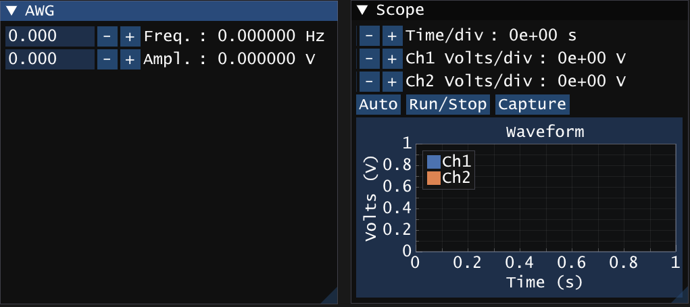

# 計測器（オシロスコープやファンクションジェネレータなど）への設定の書き込み、及び読み込み

## 課題1



```cpp
void ShowWindow4(const ViSession awg) {
    // ウィンドウ開始
    ImGui::SetNextWindowSize(ImVec2(500 * Gui::monitorScale, 450 * Gui::monitorScale), ImGuiCond_FirstUseEver);
    ImGui::Begin("AWG");
    /*** 描画したいImGuiのWidgetやImPlotのPlotをここに記述する ***/
    // https://github.com/ocornut/imgui
    // https://github.com/epezent/implot
    // https://github.com/daigokk/ImPlotSample
    /*** ここから *************************************************/
    static float freq = 0, ampl = 0;
    ImGui::SetNextItemWidth(200.0f * Gui::monitorScale);
    if (ImGui::InputFloat("Freq.", &freq, 1, 1)) {
        static std::string ret;
		CppVisa::cviPrintf(awg, __FILE__, __LINE__, "HORizontal:SECdiv %e\n", freq);
        ret = CppVisa::cviQueryf(awg, __FILE__, __LINE__, "HORizontal:SECdiv?\n");
		freq = atof(ret.c_str());
    }
	ImGui::SameLine();
	ImGui::Text(": %f Hz", freq);
    ImGui::SetNextItemWidth(200.0f * Gui::monitorScale);
    if (ImGui::InputFloat("Ampl.", &ampl, 1, 1)) {
        static std::string ret;
        CppVisa::cviPrintf(awg, __FILE__, __LINE__, "HORizontal:SECdiv %e\n", ampl);
        ret = CppVisa::cviQueryf(awg, __FILE__, __LINE__, "HORizontal:SECdiv?\n");
        freq = atof(ret.c_str());
    }
    ImGui::SameLine();
    ImGui::Text(": %f V", ampl);
    /*** ここまで *************************************************/
    // ウィンドウ終了
    ImGui::End();
}

void ShowWindow5(const ViSession scope) {
    // ウィンドウ開始
    ImGui::SetNextWindowSize(ImVec2(500 * Gui::monitorScale, 450 * Gui::monitorScale), ImGuiCond_FirstUseEver);
    ImGui::Begin("Scope");
    /*** 描画したいImGuiのWidgetやImPlotのPlotをここに記述する ***/
    // https://github.com/ocornut/imgui
    // https://github.com/epezent/implot
    // https://github.com/daigokk/ImPlotSample
    /*** ここから *************************************************/
    static int t_index = 0, v_index[2] = { 0 };
    static double timediv = 0, voltsdiv[2] = { 0 };
    ImGui::SetNextItemWidth(20.0f * Gui::monitorScale);
    if (ImGui::InputInt("Time/div", &t_index, 1, 1)) {
        if (t_index < 0) t_index = 0;
        if (t_index > 29) t_index = 29;
        static std::string ret;
        static double t_ranges[30] = {};
        Commands::makeRanges(30, 5e-9, t_ranges);
        CppVisa::cviPrintf(scope, __FILE__, __LINE__, "HORizontal:SECdiv %e\n", t_ranges[t_index]);
        ret = CppVisa::cviQueryf(scope, __FILE__, __LINE__, "HORizontal:SECdiv?\n");
        timediv = atof(ret.c_str());
    }
    ImGui::SameLine();
    ImGui::Text(": %.0e s", timediv);
    for(int ch =0; ch < 2; ch++) {
        ImGui::SetNextItemWidth(20.0f * Gui::monitorScale);
        std::string label = "Ch" + std::to_string(ch + 1) + " Volts/div";
        if (ImGui::InputInt(label.c_str(), &v_index[ch], 1, 1)) {
            if (v_index[ch] < 0) v_index[ch] = 0;
            if (v_index[ch] > 29) v_index[ch] = 29;
            static std::string ret;
            static double v_ranges[30] = {};
            Commands::makeRanges(30, 20e-3, v_ranges);
            CppVisa::cviPrintf(scope, __FILE__, __LINE__, "CH%d:VOLts %e\n", ch + 1, v_ranges[v_index[ch]]);
            ret = CppVisa::cviQueryf(scope, __FILE__, __LINE__, "CH%d:VOLts?\n", ch + 1);
            voltsdiv[ch] = atof(ret.c_str());
        }
        ImGui::SameLine();
        ImGui::Text(": %.0e V", voltsdiv[ch]);
	}
    if(ImGui::Button("Auto")) {
        CppVisa::cviPrintf(scope, __FILE__, __LINE__, "AUTOSet EXECute\n");
	}
    ImGui::SameLine();
    if (ImGui::Button("Run/Stop")) {
		char* ret = CppVisa::cviQueryf(scope, __FILE__, __LINE__, "ACQuire:STATE?\n");
        if(ret != nullptr && std::string(ret) == "1\n") {
            CppVisa::cviPrintf(scope, __FILE__, __LINE__, "ACQuire:STATE STOP\n");
        }
        else {
            CppVisa::cviPrintf(scope, __FILE__, __LINE__, "ACQuire:STATE RUN\n");
        }
    }
    ImGui::SameLine();
	static std::vector<double> times, voltages[2];
    if(ImGui::Button("Capture")) {
        double offset, mult;
        int length, count;
        char c;

        length = atoi(CppVisa::cviQueryf(scope, __FILE__, __LINE__, "HORizontal:RECOrdlength?\n"));

        CppVisa::cviPrintf(scope, __FILE__, __LINE__, "DATa:start 1;DATa:stop %d\n", length);
        CppVisa::cviPrintf(scope, __FILE__, __LINE__, "DATa:ENCdg RPBinary\n");
        CppVisa::cviPrintf(scope, __FILE__, __LINE__, "DATa:WIDth 1");
        offset = atof(CppVisa::cviQueryf(scope, __FILE__, __LINE__, "WFMPre:YOFf?\n"));
        mult = atof(CppVisa::cviQueryf(scope, __FILE__, __LINE__, "WFMPre:YMUlt?\n"));
        
        times.resize(length);
        for(int ch = 0; ch <2; ch++) {
            voltages[ch].resize(length);
            CppVisa::cviPrintf(scope, __FILE__, __LINE__, "DATa:SOUrce CH%d\n", ch);
            CppVisa::cviPrintf(scope, __FILE__, __LINE__, "CURVe?\n");
            viScanf(scope, "%c", &c);
            if (c != '#') exit(EXIT_FAILURE);
            viScanf(scope, "%c", &c);
            if (c < '0' && '9' < c) exit(EXIT_FAILURE);
            count = c - '0';
            for (int i = 0; i < count; i++)
            {
                viScanf(scope, "%c", &c);
                if (c < '0' && '9' < c) exit(EXIT_FAILURE);
            }
            for (int i = 0; i < length; i++)
            {
                viScanf(scope, "%c", &c);
                voltages[ch][i] = ((unsigned char)c - offset) * mult;
            }
            viScanf(scope, "%c", &c); // For deleting a delimiter in the read buffer.
		}
	}
    ImPlot::SetNextAxesToFit();
    if (ImPlot::BeginPlot("Waveform", ImVec2(-1, -1))) {
        ImPlot::SetupAxis(ImAxis_X1, "Time (s)");
        ImPlot::SetupAxis(ImAxis_Y1, "Volts (V)");
        ImPlot::PlotLine("Ch1", times.data(), voltages[0].data(), times.size());
        ImPlot::PlotLine("Ch2", times.data(), voltages[1].data(), times.size());
		ImPlot::EndPlot();
    }
    /*** ここまで *************************************************/
    // ウィンドウ終了
    ImGui::End();
}
```
## 課題2

