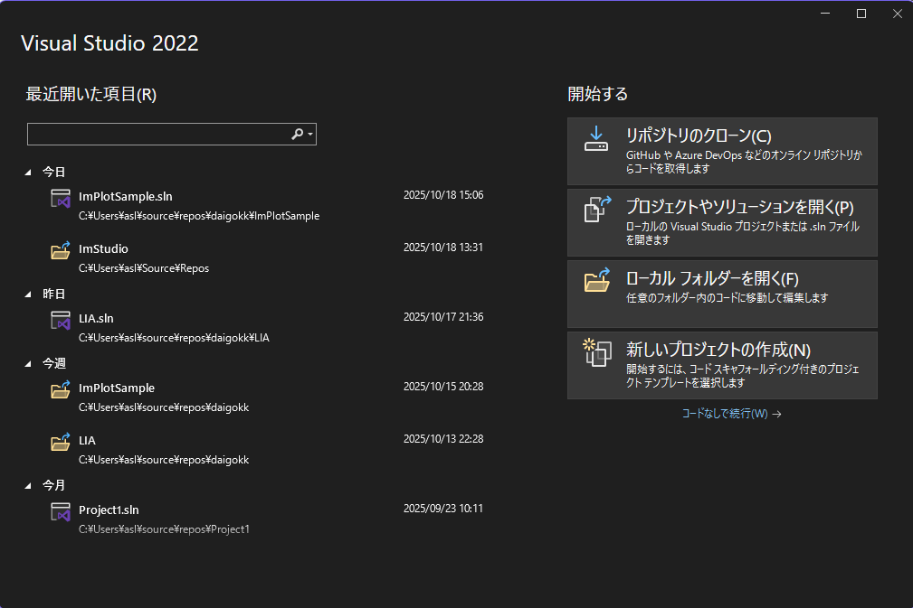
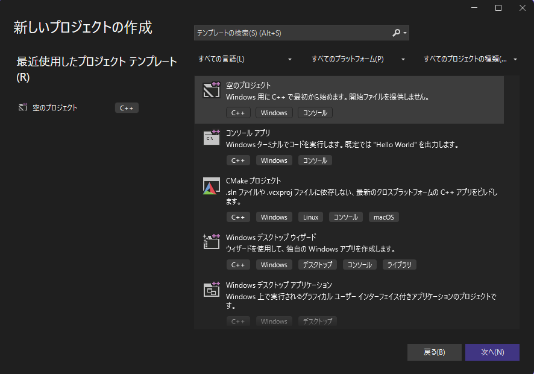
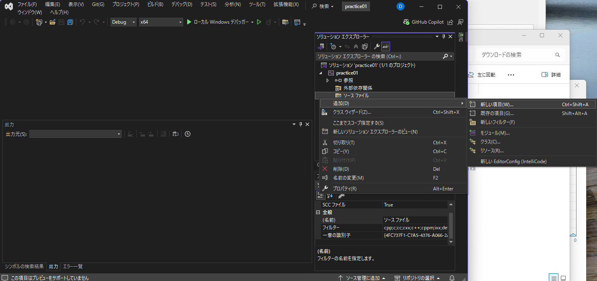
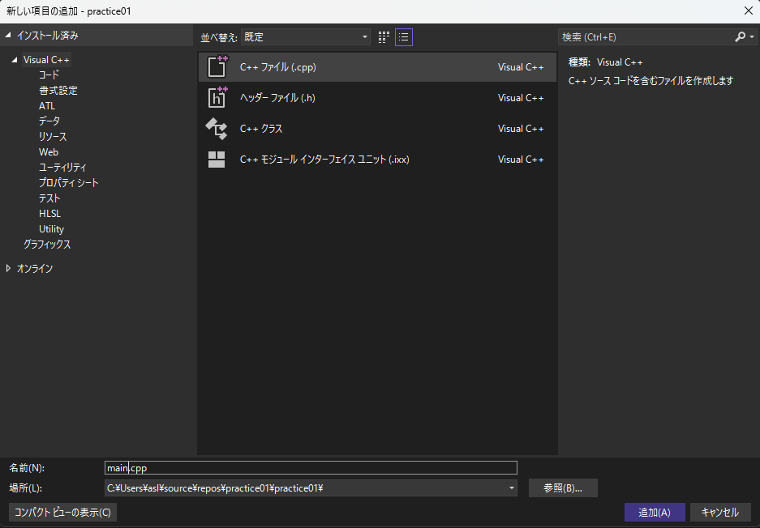
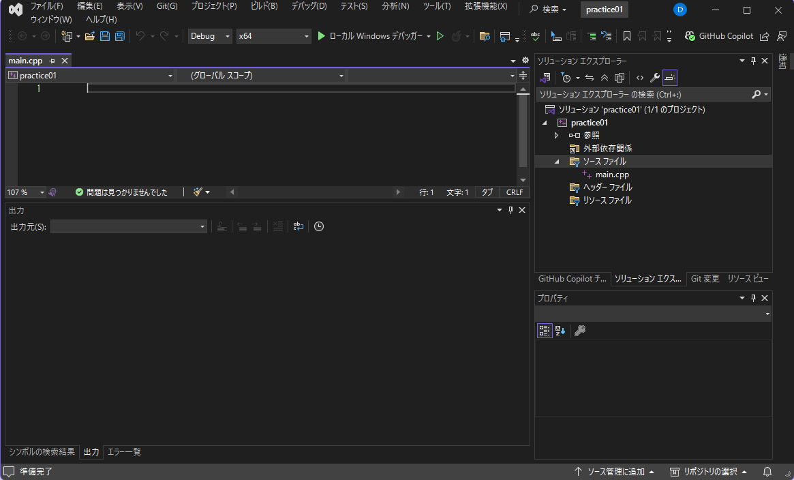
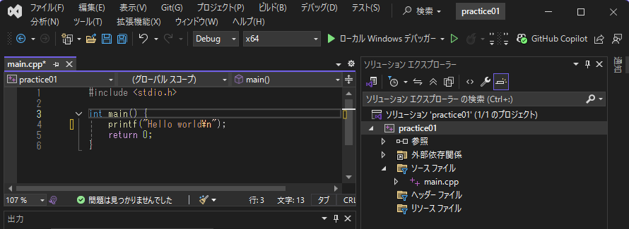
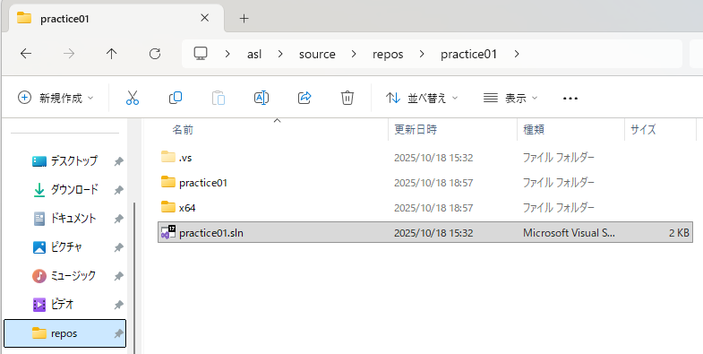

# Visual Studioの使い方
この資料では、Visual Studioを使ってC言語の基本的なプログラムを作成・実行する方法を学びます。

1. Visual Studio 起動する
    - スタートメニューから「Visual Studio」を選択
    - 起動画面が表示される
    - 画面右下の「新しいプロジェクトの作成」をクリック
    

1. 新しいプロジェクトを作成する
    - 「新しいプロジェクトの作成」画面で「空のプロジェクト」を選択。

    - 補足: 今回は基本を学ぶため、余計な設定がない「空のプロジェクト」を選びます。

1. プロジェクト名と保存場所を設定する
    - プロジェクト名を入力（例:`practice01`）
    - 保存場所を指定(Zドライブを推奨)
    - ウィンドウ右下にある「作成」ボタンをクリック
    
    - 補足: どこに保存してもプログラム開発はできますが、学校で各個人に割り当てられているネットワークドライブ(Z:\)を保存場所に選択すると、どの席のPCにログインしても同じようそのファイルアクセスできます。

1. ソースファイルを追加する
    - 「ソリューションエクスプローラー」の「ソースファイル」を右クリックして現れるショートカットメニューの「追加」→「新しい項目」をクリック
      
    - 「C++ファイル(.cpp)」を選択し、「名前」を`main.cpp`として、右下の「追加」ボタンをクリック
      
    - 「ソリューションエクスプローラー」に`main.cpp`が追加される
      
    - 補足: 「ソリューション」は複数のプロジェクトをまとめる箱のようなもの、「プロジェクト」は一つのプログラムに必要な複数のファイルをまとめたものです。この文書の例では一つのソリューションの中には一つのプロジェクトしか入っていません。
    - 補足: 拡張子`.cpp`はC++言語のプログラムであることを表します。C言語の拡張子は`.c`です。C++はCのスーパーセットなので、Ｃのプログラムを正しく実行できます。C++特有の機能を利用したライブラリを使用するためには拡張子を`.cpp`にする必要があります。

1. コードを書く
    - `main.cpp`に以下のコードを記入
    ```cpp
    #include <stdio.h>
    int main() {
      printf("Hello world\n");
      return 0;
    }
    ```

1. ビルドと実行
    - メニューの「デバッグ」→「デバッグの開始」または「F5」。緑色の再生マークのアイコン「▶ローカル Windows デバッガー」をクリック、でも可。
      
    - コンソール画面(黒いウィンドウ)がポップアップし「Hello world」と表示される
      
    - 補足: プログラムが終了している場合(今回の場合だと`Hello world`が表示されたら)、Enterキーを押すと閉じることができます。
    - 補足: 「ビルド」はプログラムをPCがわかる形（実行ファイル）に変換する作業のことを言います。

1. Visual Studioを終了してから再度始める場合
    - ソリューションファイル(`*.sln`、例:`practice01.sln`)をダブルクリック
      

1. エラーが出た場合
    - 赤い文字の内容を確認し、スペルミス(例えば、正`printf`、誤`print`とか)や記号の抜け(例えば`;`)がないか見直しましょう。
    - カッコ(`{}`、`()`または`[]`)の対応関係は合っていますか？インデント(左側の空白、段落、字下げのこと)とカッコの位置を合わせると、間違えにくくなります。

    ## 💻 初学者が最もつまずく3大エラー

    | エラーの種類 | 具体的なミス | Visual Studioでのエラーメッセージのヒント |
    | :--- | :--- | :--- |
    | **1. 構文（文法）エラー** | **セミコロン `;` の付け忘れ** | `expected ';'`（`;`が必要です）、またはエラーが発生した行の**次の行**に表示されることが多いです。 |
    | **2. スペルミス** | 関数名（例:`printf`を`print`）や変数名の**アルファベットのミス**。 | `'XXX' undeclared`（`XXX`が宣言されていません）、または`identifier not found`（識別子が見つかりません）。 |
    | **3. 括弧の対応ミス** | `()`、`[]`、`{}`の**対応関係が崩れている**。特に`{}`を閉じ忘れることが多い。 | エラーが**大量に連鎖的**に発生しやすいです。`expected '}'`（`}`が必要です）が表示されることもあります。 |
